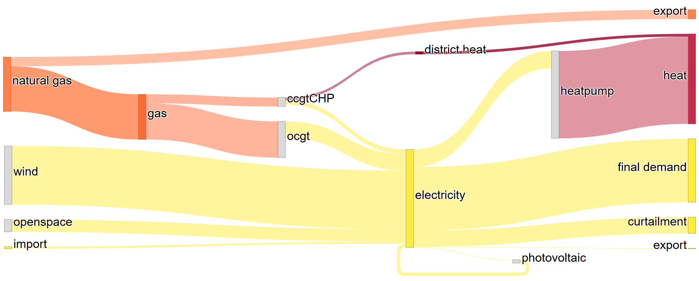

```@raw html
<style>
table.tabelle2 td {
  padding-left: 0.57em;
  padding-right: 0.57em;
  border-right: solid 1px;
  border-color: #dbdbdb;
  font-size: small;
}
ul.liste {
  list-style-position: outside;
  padding-left: 1em;
  margin-left: 0em;
  margin-top: 0em;
  white-space: nowrap;
  display:inline-block;
  text-align: left;
}
pre.inline {
   display: inline;
}
</style>
```
# Plots


[PyCall](https://github.com/JuliaPy/PyCall.jl)
[plotly](https://github.com/plotly/plotly.py)

# Node trees

```julia
plotTree(tree_sym::Symbol, anyM::anyModel)                                
```

```@raw html
<p style="text-align:center;">
```

```@raw html
<table class="tabelle2">
<tbody>
<tr>
<td><strong>argument</strong></td>
<td><strong>explanation</strong></td>
<td style="border-right:none"><strong>default</strong></td>
</tr>
<tr>
<td><code>plotSize</code></td>
<td>
<ul class="liste">
<li>control length and width of plot in inches</li>
</ul>
</td>
<td style="border-right:none"><code>(8.0,4.5)</code></td>
</tr>
<tr>
<td><code>fontSize</code></td>
<td>
<ul class="liste">
<li>bla</li>
</ul>
</td>
<td style="border-right:none"><code>12</code></td>
</tr>
<tr>
<td><code>useColor</code></td>
<td>
<ul class="liste">
<li>bla</li>
</ul>
</td>
<td style="border-right:none"><code>true</code></td>
</tr>
<tr>
<td><code>wide</code></td>
<td>
<ul class="liste">
<li>bla</li>
</ul>
</td>
<td style="border-right:none"><code>fill(1.0,30)</code></td>
</tr>
</tbody>
</table>
```


# Energy flow


### Node graph

```@raw html
<p style="text-align:center;">
```

```julia
plotEnergyFlow(:graph,anyM::anyModel)
```

```@raw html
<table class="tabelle2">
<tbody>
<tr>
<td><strong>argument</strong></td>
<td><strong>explanation</strong></td>
<td style="border-right:none"><strong>default</strong></td>
</tr>

<tr>
<td><code>plotSize</code></td>
<td>
<ul class="liste">
<li>control length and width of plot in inches</li>
</ul>
</td>
<td style="border-right:none"><code>(16.0,9.0)</code></td>
</tr>

<tr>
<td><code>fontSize</code></td>
<td>
<ul class="liste">
<li>bla</li>
</ul>
</td>
<td style="border-right:none"><code>12</code></td>
</tr>

<tr>
<td><code>useColor</code></td>
<td>
<ul class="liste">
<li>bla</li>
</ul>
</td>
<td style="border-right:none"><code>false</code></td>
</tr>

<tr>
<td><code>replot</code></td>
<td>
<ul class="liste">
<li>bla</li>
</ul>
</td>
<td style="border-right:none"><code>true</code></td>
</tr>

<tr>
<td><code>scaDist</code></td>
<td rowspan="3"; style="border-bottom:none">
<ul class="liste">
<li>bla</li>
</ul>
</td>
<td style="border-right:none"><code>0.5</code></td>
</tr>

<tr>
<td><code>maxIter</code></td>
<td style="border-right:none"><code>5000</code></td>
</tr>

<tr>
<td><code>initTemp</code></td>
<td style="border-right:none"><code>2.0</code></td>
</tr>

</tbody>
</table>
```


```julia
moveNode!(anyM::anyModel,newPos_arr::Array{Tuple{String,Array{Float64,1}},1})
```

### Sankey diagramm



```@raw html
<a href="../assets/sankey_example.html">example</a>
```

```julia
plotEnergyFlow(:sankey,anyM::anyModel)
```


```@raw html
<table class="tabelle2">
<tbody>
<tr>
<td><strong>argument</strong></td>
<td><strong>explanation</strong></td>
<td style="border-right:none"><strong>default</strong></td>
</tr>

<tr>
<td><code>plotSize</code></td>
<td>
<ul class="liste">
<li>control length and width of plot in inches</li>
</ul>
</td>
<td style="border-right:none"><code>(16.0,9.0)</code></td>
</tr>

<tr>
<td><code>minVal</code></td>
<td>
<ul class="liste">
<li>bla</li>
</ul>
</td>
<td style="border-right:none"><code>0.1</code></td>
</tr>

<tr>
<td><code>filterFunc</code></td>
<td>
<ul class="liste">
<li>bla</li>
</ul>
</td>
<td style="border-right:none"><code>x -> true</code></td>
</tr>

<tr>
<td><code>dropDown</code></td>
<td>
<ul class="liste">
<li>bla</li>
</ul>
</td>
<td style="border-right:none"><code>(:region,:timestep)</code></td>
</tr>

<tr>
<td><code>useTeColor</code></td>
<td>
<ul class="liste">
<li>bla</li>
</ul>
</td>
<td style="border-right:none"><code>true</code></td>
</tr>

</tbody>
</table>
```

# Styling

`graInfo`

graph::flowGraph

names::Dict{String,String}

colors::Dict{String,Tuple{Float64,Float64,Float64}}
